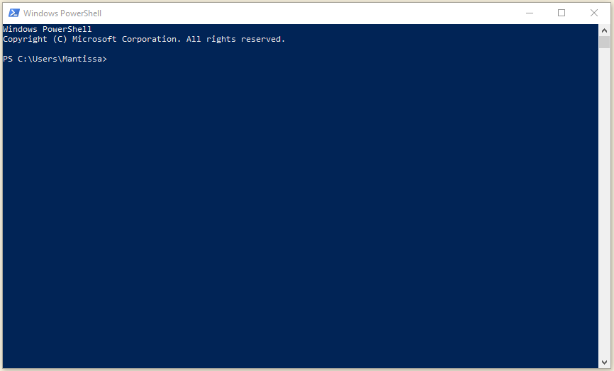
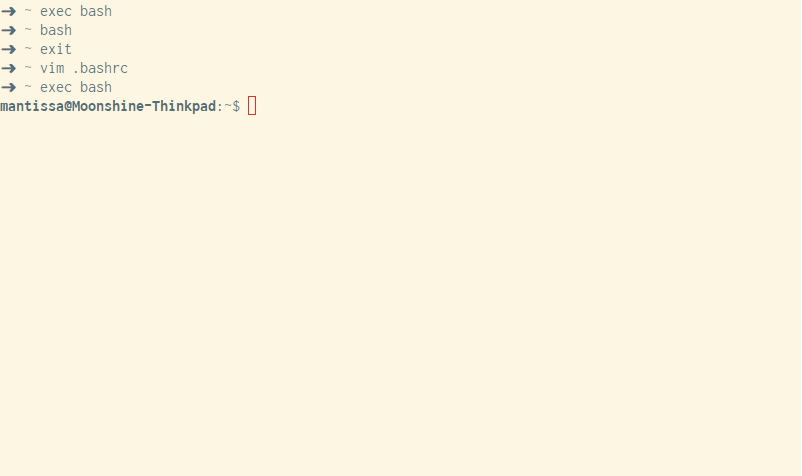
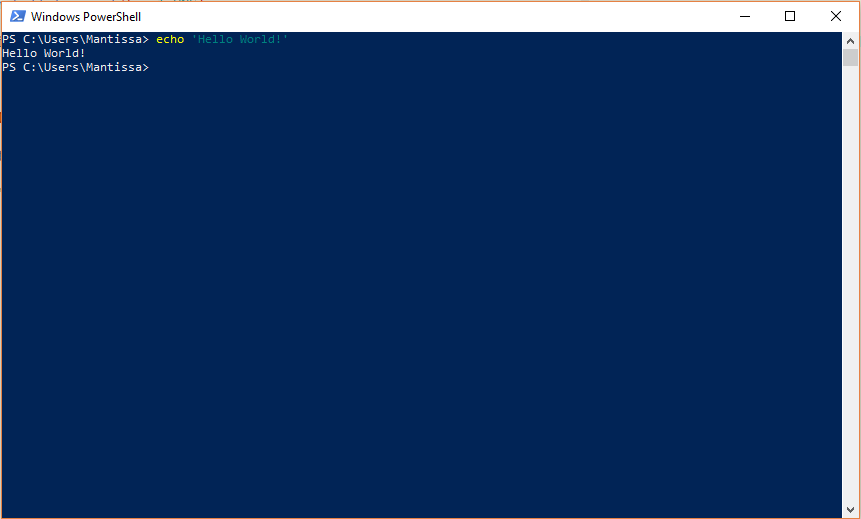
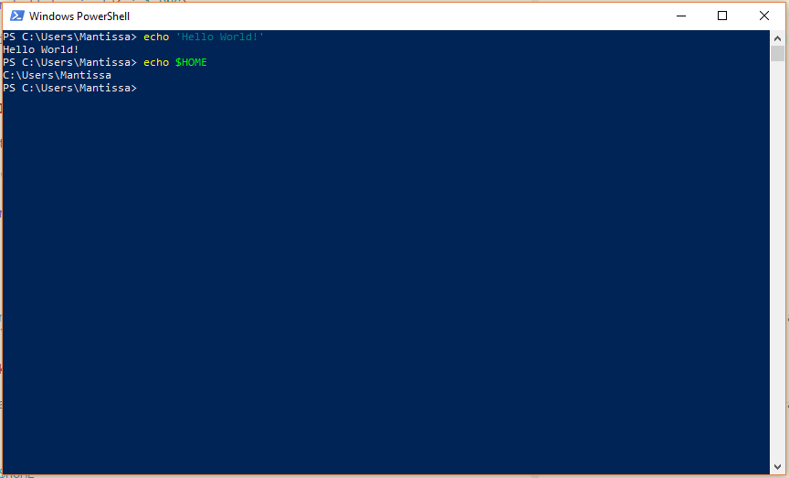
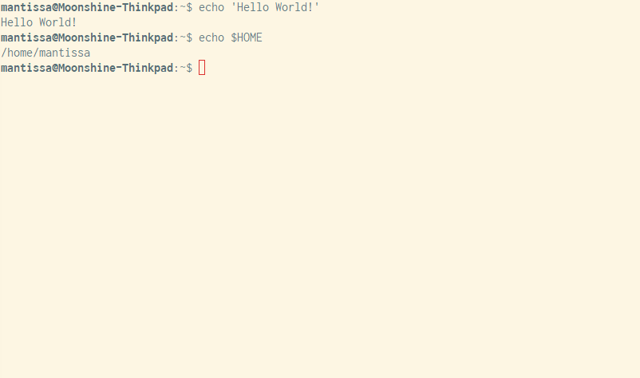
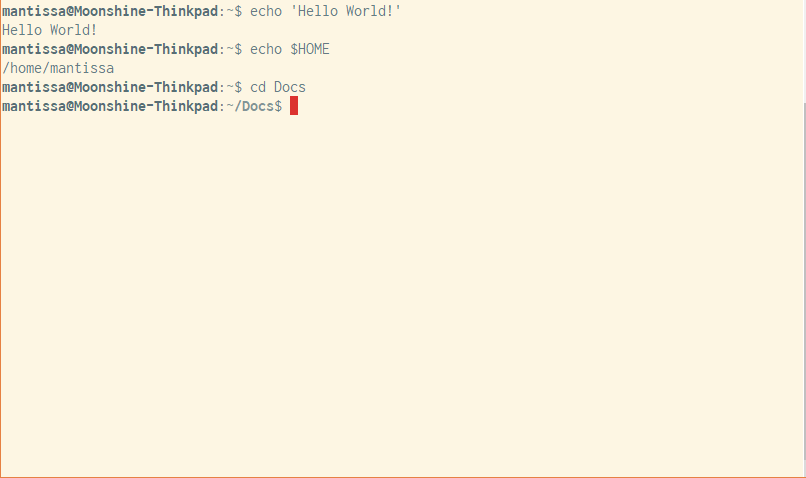
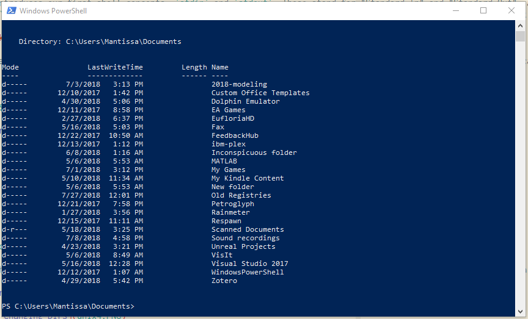
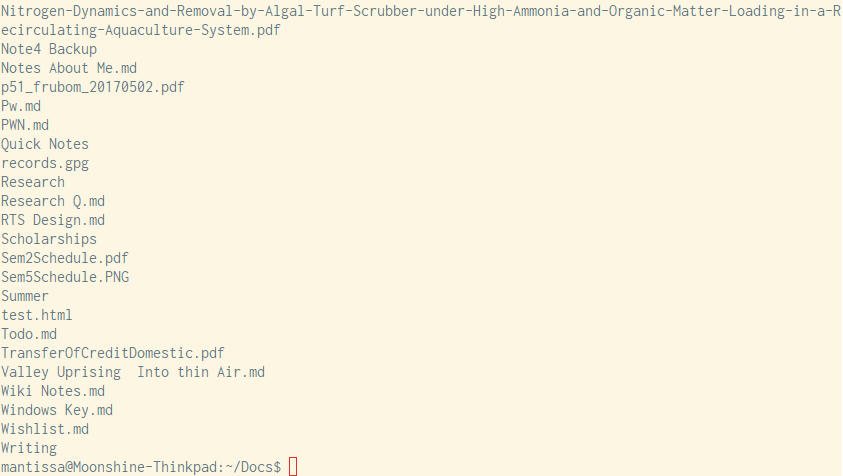
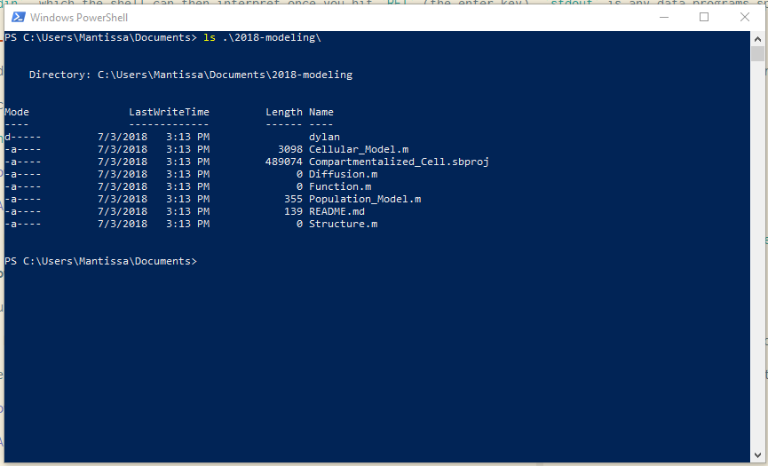
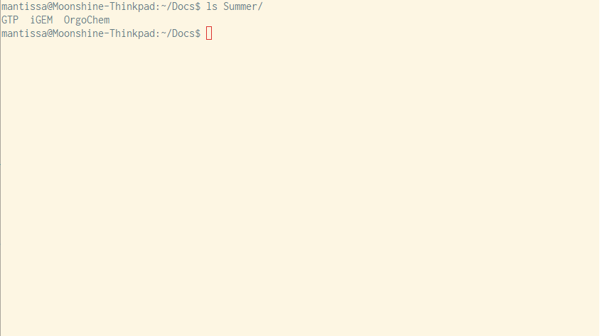

# Introduction to the Command Line for iGEMmers

This is a brief introduction to the command line, intended for anyone on any team in iGEM.

I will be providing parallel instructions for both Windows and UNIX users. Note that if you are a Mac user, you fall under the category of UNIX users, as commands are slightly different on these two operating systems.

## Launching a Terminal

A **terminal** is an interface of some kind to a **shell**. The terminal is usually defined as the window that contains your command line.

For Windows users, we reccommend the using **Powershell**, which comes with its own terminal. For Linux users, we reccommend either using your distro's build in terminal emulator, probably named Terminal or some such. Macs come with a built-in terminal emulator as well, also called Terminal; though [iTerm2](https://www.iterm2.com/) is the most popular amongst Mac terminal users. Linux and Mac users will likely being some variant of **sh**. I will be using **BASH**, the most common **sh**-based shell, but these commands are fairly generic and should apply to almost all Unix shells.

Windows users can find Powershell in the start menu just by searching for it. Alternatively, a Powershell can be launched through the admin menu by typing `C-x i` (Ctrl+X i).



Launching the terminal will differ depending on which Unix you are using. Mac users can find Terminal in Launchpad. Linux users are on their own.



## Hello World

Obligatory Hello World:

`echo 'Hello World'` will work in both Powershell and BASH.




`echo` is a command which spits out whatever you send to it into `stdout`.

This introduces our first shell concepts: `stdin` and `stdout`. These stand for "Standard In" and "Standard Out"; as you might've guessed, this refers to user input and shell output. Anything you type into a shell is passed to `stdin`, which the shell can then interpret once you hit `RET` (the enter key). `stdout` is any data programs spit out, and will be displayed directly in the shell.

## Looking Around and Moving Around

By default, a user tty (tty is short for `Terminal`. It's actually short for `teletypewriter`, but that's historical) will start in the $HOME directory. $HOME is a variable; dollar signs denote variables in both Powershell and BASH.

We can actually find out where our terminal starts using a command we've already learned:

`echo $HOME`





So, by default, Windows users' shells start in `C:\Users\<username>`, while Unix users start in `/home/<username>`.

**Now, let's move somewhere**

We use the `cd` command to move to other folders. `cd` stands for Change Directory.

`cd Documents` - Assuming you have a documents folder. If not, follow along with a similar folder like `Music` or `Desktop`.

Note that your prompt - the text automatically placed at the beginning of every line - now reads that you are at a different location. You've successfully changed directories.




Now, to see what's in this folder, we can type in `ls` or `dir`. These commands do nearly identical things, however, `ls` is not available on older shells (such as Window's cmd.exe). My point in telling you this is - if `ls` doesn't work, use `dir` instead.





This shows you all the files and subdirectories you have in the current directory.

You can also type `ls subdirectoryname` to look inside of a folder in your current directory. For example:





**And let's take it back home**

You can type `cd ~` at any time to return to your home folder.

## Creating directories

The `mkdir` command lets you create new directories. We will also introduce find, and some wildcarding here; most modern shells support wildcarding, and it allows you to quickly perform operations on multiple files.

Bash:

```bash
mkdir some-igem-folder      # Make a new folder
cd some-igem-folder         # Enter that folder
mkdir {foo,bar,baz}         # Create some new folders named foo, bar, baz
mkdir -p parent/{child1,child2}/{toy1,toy2}   # Create a parent folder, two children folders, and 2 toy folders in each child folder.
find                        # Recursively show all files and directories
```
Powershell:

```powershell
mkdir some-igem-folder
cd some-igem-folder
mkdir foo
mkdir bar
mkdir baz
mkdir parent
mkdir parent/child1
mkdir parent/child2
mkdir parent/child1/toy1
mkdir parent/child1/toy2
mkdir parent/child2/toy1
mkdir parent/child2/toy2
dir -s
```

Note that this particular kind of wildcard expansion is not available on Windows. Also note that `find` does not exist on Windows; instead `dir -s` must be used.

## Conclusion, and some fun stuff

These are all the basic commands you should need to work with our command line tools.

Some other commands you may find useful:

- Move up one directory
  - Both: `cd ..`
- View instructions on how to use command
  - Both: `man commandname`
- View help on how to use cmmand
  - Both: `commandname --help`
- Create a new empty file
  - Bash: `touch filename`
  - Powershell: `echo $null >> filename` - Create a new empty file
- Remove a directory
  - Bash: `rmdir dirname` - dir must be empty. `rm -r dirname` to delete a filled directory
  - Powershell: `del dirname`
- Remove a file
  - bash: `rm filename`
  - Powershell: `rm filename` or `del filename`
- Move an item into a folder
  - Bash: `mv item destination`
- Open a simple text editor
  - Bash: `nano`
  - Powershell: There's... No build in terminal text editor. Sorry.

And now some fun stuff:

- Open a more complex text editor
  - Bash: `vi`
  - Powershell: Again, no builtin texteditors. You can download them if you want.
- Recursively list all directories and files and find files and directories by keywords
  - Bash: `find | grep keyword`
  - Powershell: `dir -s | findstr keyword`
- Recursively show all directories and files as a tree and save them to a .txt file
  - Both: `tree > tree.txt`
- Watch an ASCII version of the original Star Wars in the terminal:
  - Bash: `telnet towel.blinkenlights.nl`
  - Powershell: haha good luck
